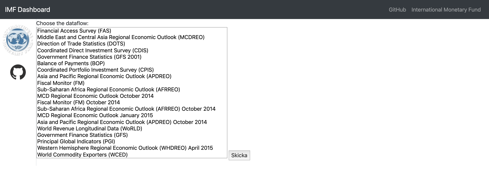
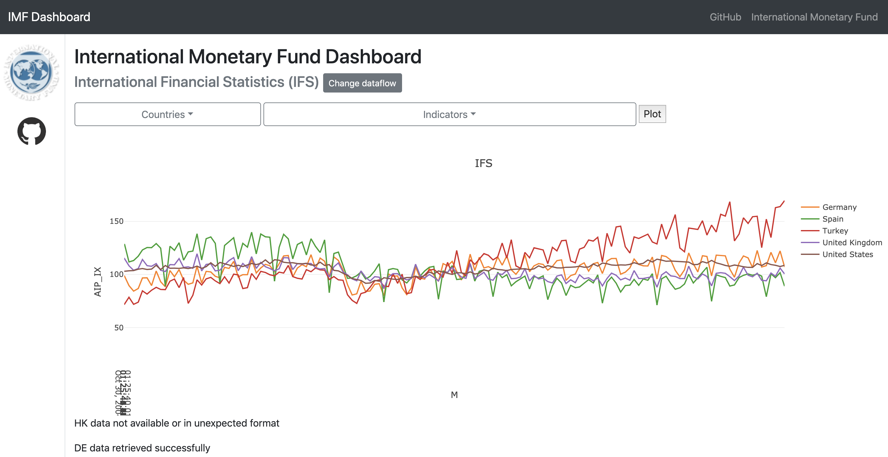

# IMF dashboard
The purpose of this project is to create a simple data dashboard to display data from the IMF's API. The frontend will be 
handled with boostrap while the backend will be done in flask. 
The tools used are:

* python 3.7.3
* pandas 0.24.2
* numpy 1.16.2
* plotly 3.7.0
* Bootstrap
* flask 1.0.2

#How to start application locally
1. Download the repo (`https://github.com/pedro-hf/imf.git`) and save on a local folder.
2. On the folder where the repo was downloaded type `python imf.py`. It should running the application on http://0.0.0.0:3001/

# Example use:
1. Access `http://0.0.0.0:3001/` with your browser. The following page should appear

2. Choose one of the dataflows available, e.g. International Financial Statistics (IFS) and pres "send" This will take you
to a new page where you can choose countries and an indicator to plot. Very few dataflows and indicators will be able to be 
plotted. The reason is that there is a miriad of dataflows and indicators and most of them are empty or have an specific data
structure that I did not account for. _Economic Activity, Industrial production, Index_ in the IFS is displayable, choosing it
and a series of countries and pressing _plot_ should render the image below

3. Try other dataflows by pressing __change dataflow__! (e.g. Price consumer Index (PCI))